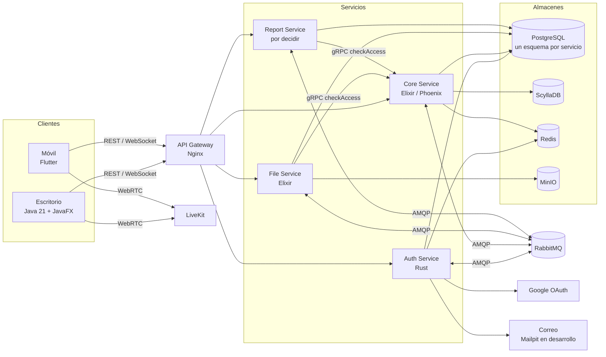

# Arquitectura

Arquitectura distribuida orientada a servicios. Dos clientes ricos consumen la misma API a través de un gateway. Cada servicio tiene tres capas (servicios, negocio y datos), es dueño de sus datos y corre en contenedores.

Las decisiones que justifican esta arquitectura están en [`docs/decisions/`](../decisions/). Los diagramas exportados de Enterprise Architect (vistas 4+1) se guardan en esta carpeta.

## Vista general

## Componentes

| Componente | Responsabilidad | Tecnología | Responsable |
|---|---|---|---|
| Cliente de escritorio | Presentación; negocio local (sesión, cola de pendientes, actualización optimista, voz); datos locales | Java 21, JavaFX 21, SQLite, Maven | @Maple-M136279841 |
| Cliente móvil | Mismas funciones principales, con prioridad en comunicación y consulta (RES-05) | Flutter (Dart), SQLite con Drift | @roluva |
| API Gateway | TLS, enrutamiento REST, WebSocket y gRPC, límite de peticiones | Nginx | @tuzc0 |
| Auth Service | IdentityService: registro, verificación, inicio de sesión (correo y Google), tokens, sesiones, recuperación de contraseña y perfil de usuario | Rust (Axum, Tokio, SQLx) | @tuzc0 |
| Core Service | CommunityService, MessagingService, RealtimeService, ProjectService, NotificationService y plano de control de VoiceService | Elixir (Phoenix, OTP) | @Maple-M136279841 |
| File Service | Recepción, validación, almacenamiento, vistas previas y entrega de archivos | Elixir | @Maple-M136279841 |
| Report Service | Agregados de actividad y reportes | Por decidir (propuesta: Elixir) | @roluva |
| Servidor de medios | Transporte del audio de los canales de voz | LiveKit autoalojado | @tuzc0 |
| Broker | Eventos asíncronos entre servicios | RabbitMQ | @tuzc0 |
| Almacenes | Persistencia | PostgreSQL, ScyllaDB, Redis y MinIO | @tuzc0 (infraestructura) |

## Comunicación

| Origen y destino | Mecanismo | Uso |
|---|---|---|
| Cliente y gateway | REST sobre HTTPS | Perfil, grupos, proyectos, tareas, reportes e historial |
| Cliente y Core | WebSocket sobre TLS (canales de Phoenix) | Mensajería en tiempo real, presencia y notificaciones |
| Cliente y File Service | gRPC con streaming **o** REST (pendiente) | Transferencia de archivos |
| Cliente y LiveKit | WebRTC | Audio; la credencial la emite VoiceService (D-15) |
| Auth y Google | HTTPS (OAuth 2.0 y OpenID Connect) | Inicio de sesión con Google (CU-04) |
| Auth y servidor de correo | SMTP (Mailpit en desarrollo) | Verificación de cuenta y recuperación de contraseña |
| Servicios y CommunityService (Core) | gRPC | Verificación de pertenencia y permisos (`checkAccess`) |
| Servicios y Auth | HTTPS | Obtención de la clave pública para verificar tokens (D-02, D-07) |
| Entre servicios | AMQP (RabbitMQ) | Eventos `message.created`, `task.updated`, `user.updated` y otros (D-04) |

## Propiedad de los datos

| Servicio | Almacén | Datos |
|---|---|---|
| Auth | PostgreSQL (esquema `auth`) y Redis | Credenciales, identidad de Google, estado de verificación y perfil; sesiones e intentos fallidos |
| Core | PostgreSQL (esquema `core`), ScyllaDB y Redis | Grupos, membresías, invitaciones, canales, proyectos, tareas y notificaciones; mensajes y reacciones; presencia y caché de permisos |
| File Service | MinIO y PostgreSQL (esquema `files`) | Contenido de los archivos; metadatos |
| Report Service | PostgreSQL (esquema `reports`) | Agregados de actividad |

Todos los servicios comparten una instancia y una base de datos de PostgreSQL, con un esquema y un usuario por servicio (D-13). Ningún servicio lee el esquema de otro: si necesita un dato ajeno, lo pide por contrato o mantiene una copia actualizada por eventos (por ejemplo, nombre y foto del usuario por `user.updated`, D-06). El detalle de cada modelo está en [`docs/database/`](../database/).

## Seguridad entre componentes

- Auth firma los JWT con Ed25519 (D-07) y publica la clave pública.
- Nginx no valida tokens (D-02): **cada servicio verifica el JWT** en cada petición y, para recursos de un grupo, pregunta a Core con `checkAccess`.
- La posesión de un token válido no basta para acceder a un recurso: la autorización se decide por rol en cada operación (RNF-SEG-03).

## Escenarios de concurrencia

| # | Escenario | Mecanismo | CU |
|---|---|---|---|
| 1 | Varios usuarios escriben a la vez en el mismo canal | El servidor asigna el orden (timeuuid, D-08) | CU-16 |
| 2 | Un mensaje se reenvía tras una reconexión | Idempotencia por `client_message_id` | CU-16 |
| 3 | Edición, eliminación o reacción simultánea sobre el mismo mensaje | Procesamiento en orden; una reacción por usuario y tipo | CU-18, CU-19 |
| 4 | Dos usuarios usan a la vez el último cupo de una invitación | Actualización condicional atómica y unicidad usuario-grupo | CU-11 |
| 5 | Dos usuarios modifican la misma tarea | Control optimista por número de versión | CU-26 a CU-28 |
| 6 | Un administrador cambia un rol mientras el usuario opera | Autorización en cada operación e invalidación de la caché de permisos | CU-14 |
| 7 | Entradas y salidas simultáneas en un canal de voz | Un proceso por sala (OTP) que aplica los cambios en orden | CU-22 |
| 8 | Muchas conexiones y presencia simultáneas | Procesos ligeros de Elixir y presencia en Redis | CU-16, CU-31 |

## Voz

- La prueba de concepto ([sonimbus-uv/poc-voice-javafx](https://github.com/sonimbus-uv/poc-voice-javafx)) conectó JavaFX con LiveKit autoalojado usando `webrtc-java` 0.18.0 y el SDK comunitario `Trirrin/livekit-java-sdk` v0.1.4.
- El SDK se adoptó como fork en [`clients/desktop/livekit-sdk/`](../../clients/desktop/livekit-sdk/) y se usa solo detrás de una interfaz propia de la capa de negocio del cliente, para poder sustituirlo.
- El token de sala es un JWT firmado con la clave y el secreto de la API de LiveKit; lo genera VoiceService en Core con `Joken` (D-15).
- El móvil usa el SDK oficial de LiveKit para Flutter.
